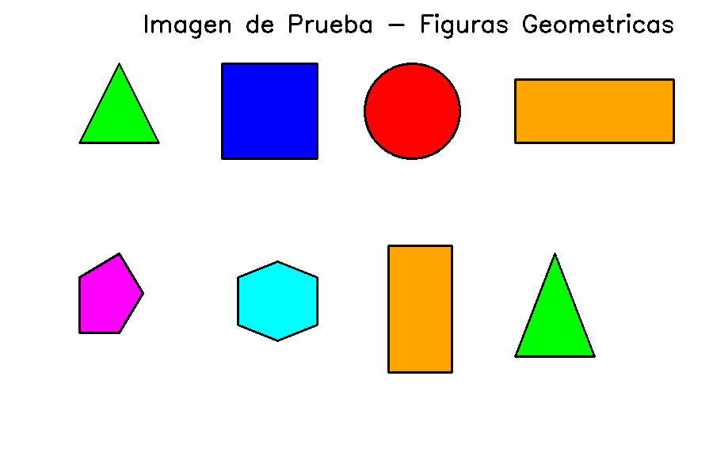

# 🔍 Detector de Figuras Geométricas

<div align="center">


</div>

## 📖 Descripción

Aplicación de escritorio en Python con interfaz gráfica que utiliza visión por computadora para reconocer y clasificar automáticamente figuras geométricas en imágenes.



## ✨ Características
## ✨ Características

- 🔷 **Detección Automática**: Reconoce triángulos, cuadrados, rectángulos, círculos, pentágonos y hexágonos
- 🎨 **Colores Distintivos**: Cada tipo de figura se marca con un color diferente
- 🖼️ **Visualización Dual**: Muestra imagen original y procesada lado a lado
- 📊 **Estadísticas**: Resumen detallado del número de figuras detectadas por tipo
- 💻 **Interfaz Intuitiva**: GUI amigable construida con Tkinter
- 🚀 **Fácil de Usar**: Scripts de ejecución rápida incluidos

## 🎨 Código de Colores

| Figura | Color | Criterio |
|--------|-------|----------|
| � Triángulos | Verde | 3 vértices |
| 🔵 Cuadrados | Azul | 4 vértices, proporción ~1:1 |
| 🟠 Rectángulos | Naranja | 4 vértices |
| 🟣 Pentágonos | Magenta | 5 vértices |
| 🔷 Hexágonos | Cian | 6 vértices |
| 🔴 Círculos | Rojo | Alta circularidad |

## 🚀 Inicio Rápido

### Instalación

1. Clona este repositorio:
```bash
git clone https://github.com/TU_USUARIO/geometric-shape-detector.git
cd geometric-shape-detector
```

2. Instala las dependencias:
2. Instala las dependencias:
```bash
pip install -r requirements.txt
```

### Ejecución

**Opción 1 - Windows (Recomendada):**
```bash
ejecutar.bat
```

**Opción 2 - Línea de comandos:**
```bash
python geometric_shape_detector.py
```

## 📋 Uso

1. **Cargar Imagen**: Haz clic en el botón "📁 Cargar Imagen" y selecciona una imagen
2. **Detectar**: Haz clic en "🔍 Detectar Figuras" para iniciar el análisis
3. **Resultados**: Revisa las figuras detectadas y el resumen estadístico
4. **Limpiar**: Usa "🗑️ Limpiar" para empezar con una nueva imagen

## 🧪 Probar con Imagen de Ejemplo

El proyecto incluye una imagen de prueba (`test_shapes.png`) con varias figuras geométricas.

Para generar nuevas imágenes de prueba:
```bash
python crear_imagen_prueba.py
```

## 🛠️ Tecnologías Utilizadas

- **Python 3.7+**: Lenguaje de programación
- **OpenCV (cv2)**: Procesamiento de imágenes y detección de contornos
- **NumPy**: Operaciones matemáticas y manipulación de arrays
- **Tkinter**: Interfaz gráfica de usuario
- **Pillow (PIL)**: Manejo de imágenes para la GUI

## � Estructura del Proyecto

```
geometric-shape-detector/
│
├── geometric_shape_detector.py    # Aplicación principal
├── crear_imagen_prueba.py         # Generador de imágenes de prueba
├── test_shapes.png                # Imagen de ejemplo
├── requirements.txt               # Dependencias Python
├── ejecutar.bat                   # Script de ejecución (Windows)
├── .gitignore                     # Archivos ignorados por Git
│
├── LEEME_PRIMERO.txt             # Guía de inicio rápido
├── GUIA_RAPIDA.txt               # Guía visual detallada
├── INDICE.txt                    # Índice del proyecto
├── RESUMEN_FINAL.txt             # Resumen completo
└── README.md                     # Este archivo
```

## 💡 Consejos para Mejores Resultados

- ✅ Usa imágenes con **buen contraste** entre figuras y fondo
- ✅ Las figuras deben estar **claramente definidas**
- ✅ Fondo **simple y uniforme** funciona mejor
- ✅ Las figuras deben tener al menos **500 píxeles de área**
- ✅ Evita imágenes borrosas o con mucho ruido

## � Requisitos del Sistema

- **Sistema Operativo**: Windows, Linux, macOS
- **Python**: 3.7 o superior
- **RAM**: Mínimo 2GB
- **Espacio en Disco**: ~50MB

## 📦 Dependencias

```
opencv-python==4.8.1.78
numpy==1.24.3
pillow==10.0.0
```

## 🤝 Contribuciones

Las contribuciones son bienvenidas. Por favor:

1. Fork el proyecto
2. Crea una rama para tu feature (`git checkout -b feature/AmazingFeature`)
3. Commit tus cambios (`git commit -m 'Add some AmazingFeature'`)
4. Push a la rama (`git push origin feature/AmazingFeature`)
5. Abre un Pull Request

## 📄 Licencia

Este proyecto está bajo la Licencia MIT. Ver el archivo `LICENSE` para más detalles.

## 👤 Autor

**Fabia**

## 🌟 Agradecimientos

- OpenCV por su excelente librería de visión por computadora
- La comunidad de Python por las herramientas y recursos

## 📞 Soporte

Si encuentras algún problema o tienes sugerencias:

1. Revisa la documentación en `GUIA_RAPIDA.txt`
2. Abre un issue en GitHub
3. Consulta la sección de troubleshooting

---

<div align="center">

**¡Disfruta detectando figuras geométricas!** 🎉

⭐ Si este proyecto te resultó útil, considera darle una estrella

</div>
